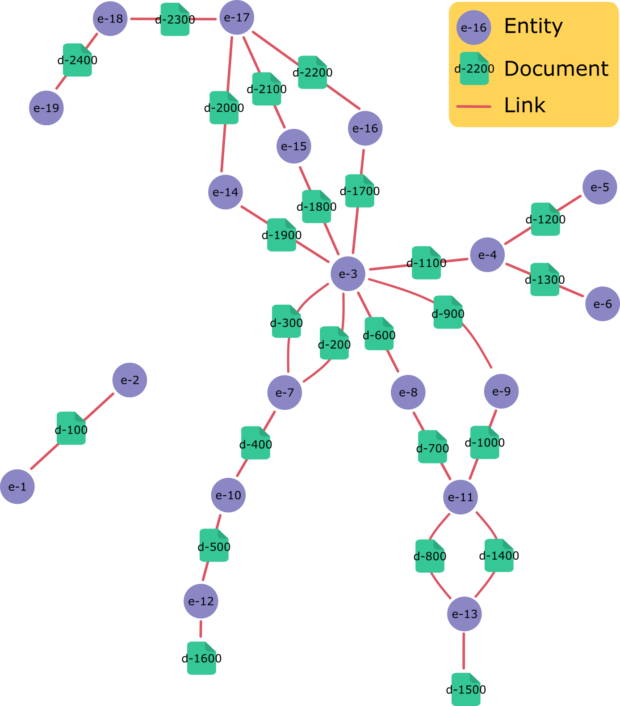

# Shortest Path using a limited Breadth First Search approach

## Introduction

This Golang project performs a shortest path analysis using a Breadth First Search (BFS) approach. It is designed for data that represents a bipartite graph, e.g. composed of entities and documents (such as authors and academic papers). The code collapses the bipartite graph to a unipartite graph for search efficiency reasons. For example, a pair of authors could write a number of papers together, but the connectivity of the authors is more important than the papers themselves.

The code contains a test case where the documents and entities are as represented in the figure below.

The code collapses the bipartite graph to a unipartite graph, as shown below.

## Usage

- Define the `config.json` file.

- Run all of the test using `go test`.

- Build an EXE from the code using `go build`.

- Run the EXE. Note that it simply looks for a `config.json` in the same folder as the EXE.

- A CSV format results file will be produced where paths could be found within the maximum search distance.
