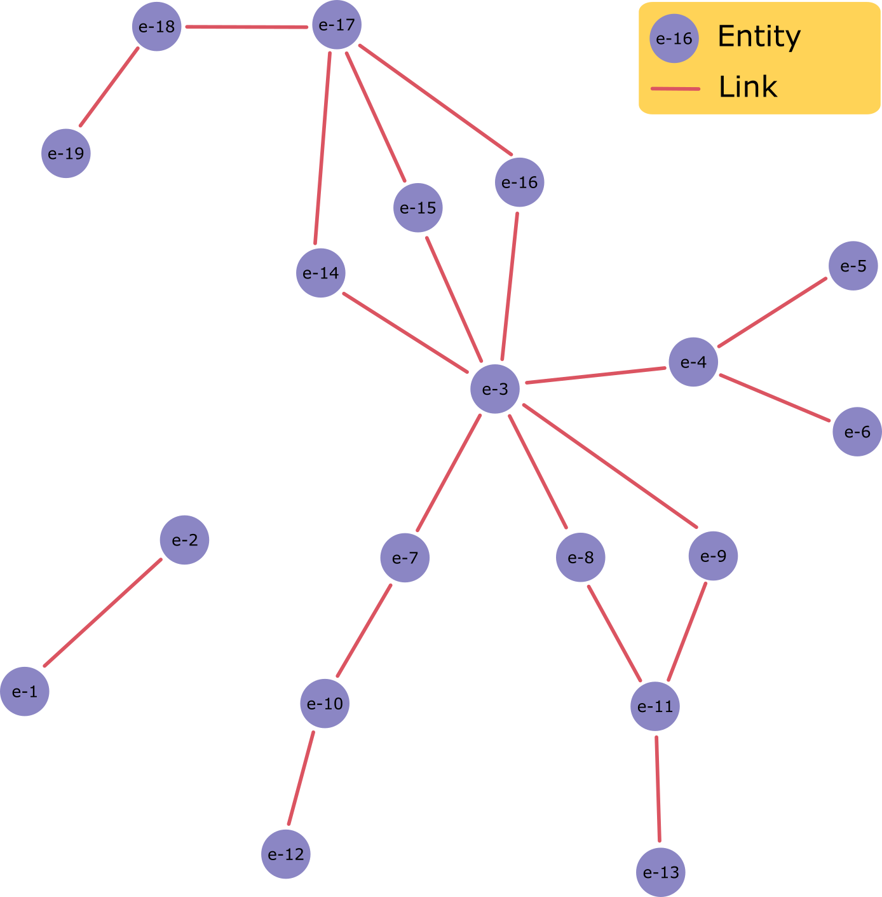

# Shortest Path using a limited Breadth First Search approach

## Introduction

This Golang project performs a shortest path analysis using a Breadth First Search (BFS) approach. It is designed for data that represents a bipartite graph, e.g. composed of entities and documents (such as authors and academic papers).

The code collapses the bipartite graph to a unipartite graph for search efficiency reasons. For example, a pair of authors could write a number of papers together, but the connectivity of the authors is more important than the papers themselves.

Entities can be ignored when reading the graph from file to avoid finding shortest paths through nodes with certain properties, e.g. a high betweeness centrality. This saves the user having to pre-process the input CSV files.

The code contains a test case (in the folder `test-data-full`) where the documents and entities are as represented in the figure below.


The code collapses the bipartite graph to a unipartite graph, as shown below.



The bipartite graph is constructed from CSV files with the required header. An example of one such CSV file is:

```
entity_id,document_id
e-1,d-100
e-2,d-100
e-3,d-200
```

The paths to try to find are expressed in the JSON file. An example of the output from the code is:

| Source entity ID | Destination entity ID | Number of hops | Path                  | Link                                               |
| ---------------- | --------------------- | -------------- | --------------------- | -------------------------------------------------- |
| e-1              | e-2                   | 1              | e-1\|e-2              | http://192.168.99.100:8080/show/e-1,e-2            |
| e-8              | e-11                  | 1              | e-8\|e-11             | http://192.168.99.100:8080/show/e-8,e-11           |
| e-3              | e-18                  | 3              | e-3\|e-14\|e-17\|e-18 | http://192.168.99.100:8080/show/e-3,e-14,e-17,e-18 |

The web-app link is configurable. If it's not required, just set `webapp_link` to an empty string in the JSON config.

## Usage

- Define the `config.json` file.

- Run all of the test using `go test`.

- Build an EXE from the code using `go build`.

- Run the EXE. Note that it simply looks for a `config.json` in the same folder as the EXE.

- A CSV format results file will be produced where paths could be found within the maximum search distance.
